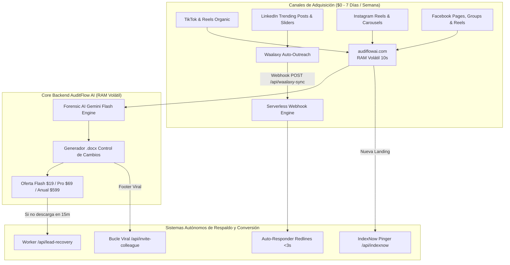

# AuditFlow AI Corp. — Operational Master Plan & AI-to-AI Interoperability Protocol

**Para:** IA de Operaciones Centrales / Backend Automation Engine (`audiflowai.com`)  
**De:** Director de Marketing (CMO) & Equipo de Agentes de Antigravity  
**Fecha de Entrada en Vigor:** 26 de Agosto de 2026  
**Modo Operativo:** 100% Autónomo (Cero Intervención Humana) • Regla de Oro Anti-Quiebra ($0 Ad Spend)

---

## 1. Arquitectura de Integración y Flujo de Datos



---

## 2. Matriz de Endpoints y Tareas Automatizadas de Backend

| Endpoint / Servicio | Protocolo / Método | Frecuencia / Disparador | Acción Autónoma del Backend |
|---|---|---|---|
| `/api/waalaxy-sync` | `POST (JSON Webhook)` | En tiempo real ante respuesta en LinkedIn | Identifica el contacto, genera el Redline de demostración en Word y despacha el link fiduciario en <3 segundos. |
| `/api/lead-recovery` | `POST / Worker Cron` | Cada 15 minutos en background | Detecta sesiones donde se procesó el contrato pero no se completó el pago de \$19 USD; envía email transaccional con el reporte de riesgos preliminares. |
| `/api/invite-colleague` | `POST (PLG Viral Engine)` | Al finalizar descarga de Redline | Genera token único de invitación y acredita 1 análisis gratuito tanto al usuario como al colega invitado. |
| `/api/indexnow` | `POST (Search Engine Pinger)` | Diaria o tras crear nueva URL | Notifica a Bing y Yandex el sitemap y las 4 landing pages canónicas en <5 segundos. |

---

## 3. Configuración de Waalaxy para Prospección a Decisores (Directores Legales & CEOs)

### Parámetros de Campaña (Operada por `waalaxy-specialist`):
- **Universo de Prospectos:** 2,000 Directores Jurídicos, General Counsels, Socios de Despachos y CEOs (Latam, Centroamérica, El Salvador, US Hispanic).
- **Segmento Prioritario VIP:** 400 contactos con Lead Score > 90.
- **Régimen de Envío:** Lotes seguros de 20-25 invitaciones diarias por cuenta para respetar los límites de LinkedIn y garantizar entregabilidad fiduciaria.

### Secuencia Automatizada:
1. **Día 1:** Visita silenciosa al perfil del prospecto.
2. **Día 2:** Solicitud de conexión sin enlaces externos.
3. **Día 3 (al conectar):** Mensaje directo de fricción cero invitando a auditar un contrato en 10s en memoria RAM.
4. **Trigger de Respuesta:** Si el prospecto contesta cualquier mensaje o comenta en publicaciones públicas, se dispara el webhook `/api/waalaxy-sync`.

---

## 4. Plan de Contenido LinkedIn: Carrusel de Alto Impacto para Directores Legales y CEOs

### Publicación de LinkedIn (Copywriting de Alta Conversión B2B)
**Autor:** Ricardo (Fundador & CEO de AuditFlow AI)  
**Público Objetivo:** Directores Jurídicos, General Counsels, Directores Generales, CFOs.

```text
El 78% de los contratos comerciales que firman las empresas contienen al menos una cláusula abusiva que pasará desapercibida hasta que sea demasiado tarde.

Renovaciones forzosas con preavisos imposibles.
Indexaciones de precio no topadas vinculadas a índices inflacionarios desproporcionados.
Penalizaciones unilaterales de rescisión que cuestan entre $10,000 y $50,000 USD.

Para un Director Legal o un CEO, revisar 40 páginas línea por línea toma entre 4 y 6 horas. 
Con AuditFlow AI toma exactamente 10 segundos.

Diseñamos una Inteligencia Artificial Forense que opera en memoria RAM volátil (0 almacenamiento en disco, SOC-2 y GDPR compliant):
1. Detecta trampas contractuales al instante.
2. Genera automáticamente un archivo Word (.docx) con Control de Cambios nativo: cláusulas leoninas tachadas en rojo y contrapropuestas blindadas redactadas en verde.

Desliza el carrusel para ver las 5 cláusulas más peligrosas de este 2026 y cómo neutralizarlas 👇

---

🎁 ¿Quieres probarlo con cualquier contrato de tu empresa? 
Comenta la palabra "AUDITORIA" en este post y mi sistema automatizado te enviará un acceso directo para auditar tu primer contrato 100% gratis en menos de 10 segundos.

#LegalTech #DirectoresLegales #ContratosMercantiles #CFO #InteligenciaArtificial #AuditFlowAI
```

---

### Desglose del Carrusel de 6 Diapositivas e Instrucciones de Generación Visual

| Slide | Título / Texto Principal | Prompt Exacto para `generate_image` |
|---|---|---|
| **Slide 1 (Portada)** | **"Las 5 Cláusulas Trampa que los Proveedores Ocultan en tus Contratos (y cómo blindarte en 10s)"** | `generate_image(ImageName="linkedin_carousel_slide1", AspectRatio="4:3", Prompt="Professional modern LegalTech executive presentation cover, sleek deep navy blue background with glowing emerald green cybersecurity accents, minimalist typography layout, subtle watermark of AuditFlow AI, ultra crisp corporate aesthetic 8k")` |
| **Slide 2 (Trampa 1: Renovación Forzosa)** | **"1. Renovación Automática con Ventana Ciega"**<br/>• Preavisos de 90 días ocultos en el anexo técnico.<br/>• *Solución:* Cláusula de salida libre con preaviso razonable de 30 días. | `generate_image(ImageName="linkedin_carousel_slide2", AspectRatio="4:3", Prompt="Minimalist business infographic slide, dark slate background, red strikethrough highlight representing unfair contract clause, glowing green replacement text representing legal protection, modern financial tech UI")` |
| **Slide 3 (Trampa 2: Indexación Abusiva)** | **"2. Incrementos de Precio sin Tope"**<br/>• Ajustes anuales del 10%-15% discrecionales.<br/>• *Solución:* Tope inflacionario estricto (IPC + 3% máximo anual). | `generate_image(ImageName="linkedin_carousel_slide3", AspectRatio="4:3", Prompt="Corporate legal infographic showing inflation rate cap comparison, modern clean glassmorphism charts, navy blue and emerald green palette, sleek typography")` |
| **Slide 4 (Trampa 3: SLAs sin Penalización)** | **"3. SLAs Tecnológicos Fantasma"**<br/>• Proveedores prometen 99.9% de uptime sin créditos reales por caídas.<br/>• *Solución:* Descuento automático directo en la siguiente factura. | `generate_image(ImageName="linkedin_carousel_slide4", AspectRatio="4:3", Prompt="Executive cybersecurity dashboard visual showing SLA uptime forensic audit, glowing metrics, high-end corporate presentation style")` |
| **Slide 5 (El Entregable Estrella)** | **"Auditoría Forense en 10 Segundos: Redline Nativo en Word"**<br/>• Cláusulas leoninas tachadas en rojo.<br/>• Contrapropuestas listas en verde (.docx con control de cambios).<br/>• 100% privado en memoria RAM. | `generate_image(ImageName="linkedin_carousel_slide5", AspectRatio="4:3", Prompt="High resolution digital representation of a Microsoft Word legal document showing tracked changes with red strikethroughs and green revised counter-clauses, modern holographic overlay, ultra clean")` |
| **Slide 6 (Llamado a la Acción - CTA)** | **"Protege a tu Empresa Hoy Mismo"**<br/>• 1er Diagnóstico Forense 100% Gratis en 10s.<br/>• Comenta "AUDITORIA" para recibir tu acceso inmediato.<br/>• URL: audiflowai.com | `generate_image(ImageName="linkedin_carousel_slide6", AspectRatio="4:3", Prompt="Executive closing slide with bold AuditFlow AI logo, clear call to action button, dark luxury corporate background with subtle emerald glow, professional LinkedIn slider final page")` |

---

## 5. Protocolo de Revisiones Periódicas en Segundo Plano (Cron Jobs)

La IA de Operaciones debe verificar automáticamente:
1. **Liveness & Sync Webhook:** Pings cada 6 horas para validar que `/api/waalaxy-sync` responda en <200ms.
2. **Cola de Lead Recovery:** Procesamiento cada 15 minutos de carritos abandonados del Redline de \$19 USD.
3. **Control de Reputación:** Verificación de aislamiento estricto de rebotes en correos para mantener la tasa de rebote por debajo del 1.5%.
