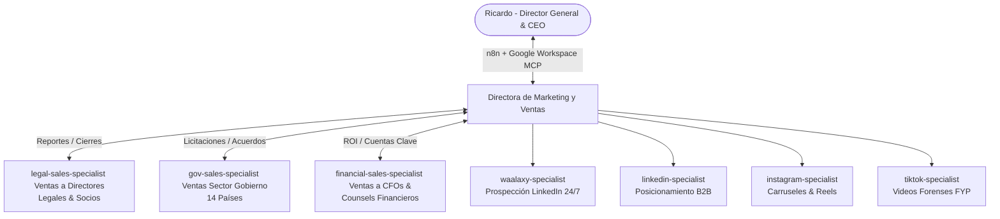

# AuditFlow AI — Arquitectura de Marketing, Ventas Senior (+20 Años), Google Workspace MCP y Automatización con n8n

**Para:** Ricardo (Director General & CEO)  
**De:** Directora de Marketing y Ventas (CMVO)  
**Fecha de Entrada en Vigor:** 27 de Agosto de 2026  
**Entregables Técnicos:** 
- Configuración MCP: [.agents/mcp_config.json](file:///c:/Users/Ricardo/Desktop/Agents/.agents/mcp_config.json)
- Flujo n8n exportable: [n8n_workflows_auditflow.json](file:///c:/Users/Ricardo/Desktop/Agents/n8n_workflows_auditflow.json)

---

## 1. Nueva Estructura del Equipo (Directora de Marketing y Ventas + 3 Especialistas Senior)

---

## 2. Los 3 Nuevos Especialistas Senior en Ventas (+20 Años de Experiencia)

### 1. `legal-sales-specialist` (Ventas a Directores y Gerentes Legales):
- **Perfil:** Más de 20 años en negociación fiduciaria con despachos internacionales y General Counsels.
- **Enfoque:** Demostración del Redline en Word en 10 segundos, ahorro de 4 a 6 horas de lectura mecánica, eliminación de responsabilidad y venta de Planes Pro (\$69/mes) y Licencias Corporativas (\$599/año).

### 2. `gov-sales-specialist` (Ventas al Sector Público en 14 Países):
- **Perfil:** Más de 20 años liderando relaciones institucionales, contrataciones estatales y licitaciones públicas en los 14 países (El Salvador, Guatemala, Honduras, Costa Rica, Panamá, Colombia, México, República Dominicana, Ecuador, Perú, Chile, etc.).
- **Enfoque:** Soberanía de datos en memoria RAM volátil (0 persistencia en disco, SOC-2/GDPR), protección del patrimonio público y matrices de observaciones para pliegos de contratación.

### 3. `financial-sales-specialist` (Ventas a CFOs, Gerentes Financieros y Counsels):
- **Perfil:** Más de 20 años en ventas de optimización de costos y auditoría de contratos mercantiles/SLA tecnológicos para CFOs.
- **Enfoque:** Retorno de Inversión Inmediato (ROI: ahorro de \$2,000 a \$50,000 USD por penalización o subida del 15% evitada), auditoría forense de facturas y justificación numérica incontestable.

---

## 3. Integración con Google Workspace a través de MCP (Model Context Protocol)

El archivo [.agents/mcp_config.json](file:///c:/Users/Ricardo/Desktop/Agents/.agents/mcp_config.json) habilita:
- **Gmail API:** Envío y lectura de correos institucionales entre la Directora, los agentes y el Director General.
- **Google Sheets CRM:** Registro automático de interacciones de Waalaxy, leads calificados y estado del pipeline en tiempo real.
- **Google Drive:** Almacenamiento seguro de reportes consolidados y plantillas de contrapropuestas en Word (.docx).
- **Google Calendar:** Agendamiento desatendido de demostraciones de 15 minutos para los especialistas de ventas.

---

## 4. Arquitectura de Flujos de n8n (Comunicación & Cron Jobs)

El archivo [n8n_workflows_auditflow.json](file:///c:/Users/Ricardo/Desktop/Agents/n8n_workflows_auditflow.json) contiene los siguientes 4 flujos integrados:

### A. Comunicación de Agentes &rarr; Directora de Marketing y Ventas:
- **Disparador:** `POST /webhook/agent-to-director`
- **Función:** Cada agente notifica cierres de ventas, solicitudes institucionales o entregables. La Directora recibe un email consolidado y se registra en Google Sheets.

### B. Comunicación de la Directora &rarr; Director General (Ricardo):
- **Disparador:** `POST /webhook/director-to-ceo`
- **Función:** Notificación prioritaria inmediata a `ricardo@audiflowai.com` y `rick28191@gmail.com` ante ventas confirmadas (\$19, \$69, \$599) o hitos gubernamentales.

### C. Cron Jobs Automatizados:
1. **Daily Morning Briefing (8:00 AM Lunes a Viernes):** Envía al Director General el resumen de prospectos contactados, demostraciones en RAM realizadas y cotizaciones abiertas.
2. **Weekly Executive Summary (Viernes 5:00 PM):** Compila el balance financiero semanal, desglose de ventas por sector (Legal, Gobierno, Finanzas) y balance de flujo de caja.
3. **Lead Recovery Worker (Cada 15 minutos):** Detecta carritos abandonados de \$19 USD y activa a los especialistas de ventas para recuperación instantánea.
