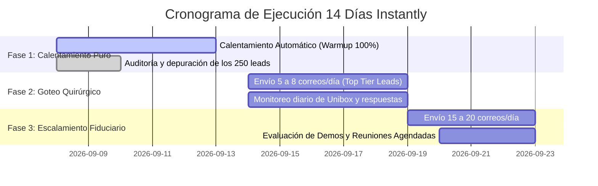

# AUDITFLOW AI — PLAN OPERATIVO DE 14 DÍAS: ENFOQUE EXCLUSIVO EN INSTANTLY.AI (OPCIÓN A)

**Fecha de Inicio:** Martes, 8 de Septiembre de 2026  
**Liderazgo:** Directora de Marketing y Ventas (CMVO) & Gerente General (COO)  
**Aprobado por:** Ricardo Bolaños (Director General)  
**Presupuesto:** $0.00 USD (Bootstrap Fiduciario)

---

## 1. OBJETIVO ESTRATÉGICO
Eliminar la dispersión operativa y el riesgo de saturación/duplicidad de prospectos, pausando temporalmente **Waalaxy** por 14 días y canalizando el 100% de la prospección B2B a través de **Instantly.ai** utilizando la nueva cuenta oficial blindada `ricardo.audiflowai@gmail.com`.

---

## 2. ACCIÓN INMEDIATA: PAUSA DE WAALAXY (PASO DE 1 MINUTO)
1. Abra la pestaña de **Waalaxy** en su navegador Chrome.
2. Diríjase a la sección **Campañas** (Campaigns).
3. Localice la campaña activa de prospección.
4. Haga clic en el botón de **Pausa ⏸️** (cambiará de verde "En curso" a naranja "En pausa").
> *Resultado:* Las acciones de LinkedIn quedan congeladas de inmediato. Ningún prospecto recibirá mensajes duplicados.

---

## 3. CRONOGRAMA MAESTRO DE 14 DÍAS EN INSTANTLY.AI

### FASE 1: CALENTAMIENTO PURO E INCUBACIÓN (Días 1 al 5: 8 al 13 de Septiembre)
* **Objetivo:** Subir el *Health Score* de `ricardo.audiflowai@gmail.com` de 0% a más del 85% sin levantar sospechas en los filtros de Google.
* **Actividad de Envío:** Exclusivamente la red de **Warmup de Instantly** (3 a 15 correos diarios simulados con respuestas automáticas positivas).
* **Campaña de Ventas:** En estado *Pausada/Preparada*.
* **Trabajo de Fondo del Equipo:**
  - Sincronización ordenada de los 250 socios de bufetes en lotes limpios.
  - Verificación de variables personalizadas: `{{firstName}}`, `{{company}}`, `{{city}}`.

### FASE 2: GOTEO QUIRÚRGICO DE PRIMERA OLA (Días 6 al 10: 14 al 18 de Septiembre)
* **Objetivo:** Disparar los primeros correos reales a los 25 socios directores más influyentes.
* **Ritmo de Envío:** **5 a 8 correos reales por día** en horario laboral de oficina (8:30 AM a 11:30 AM CST).
* **Warmup:** Sigue encendido en paralelo (consumiendo 15-20 correos de calentamiento al día).
* **Atención:** Revisión del **Unibox** de Instantly a las 11:00 AM y a las 4:00 PM para responder a cualquier interesado en menos de 15 minutos.

### FASE 3: ESCALAMIENTO Y CONVERSIÓN (Días 11 al 14: 19 al 22 de Septiembre)
* **Objetivo:** Escalar el volumen diario a velocidad de crucero.
* **Ritmo de Envío:** **15 a 20 correos diarios**.
* **Métricas Esperadas:**
  - Tasa de Apertura (*Open Rate*): > 65%
  - Tasa de Respuesta (*Reply Rate*): > 8% - 12%
  - Solicitudes de demo o consultas forenses: 2 a 4 bufetes interesados.

---

## 4. GESTIÓN UNIFICADA: UNA SOLA BANDEJA DE ENTRADA
A partir de este momento, Don Ricardo no tiene que consultar múltiples herramientas:
1. **Instantly Unibox:** Dentro de `app.instantly.ai/app/unibox`, todas las respuestas de prospectos se centralizan en una sola pantalla limpia.
2. **Gmail Escudo:** Todas las notificaciones y respuestas también caen directamente en `ricardo.audiflowai@gmail.com`.
3. **Su correo personal (`rick28191@gmail.com`):** Queda 100% libre de spam, rebotes o interacciones comerciales.

---

## 5. DECISIÓN AL DÍA 14
El **22 de Septiembre de 2026**, la Dirección Ejecutiva presentará el informe de resultados:
* Si Instantly generó las primeras demos con fluidez y cero fricción: Evaluaremos mantener la prospección de correo 100% en Instantly y reactivar Waalaxy únicamente como soporte de networking en LinkedIn.
