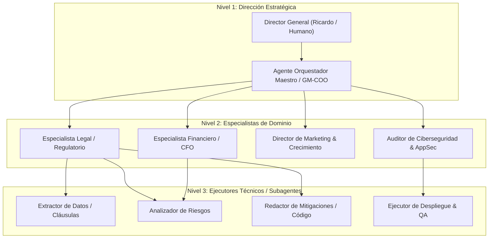
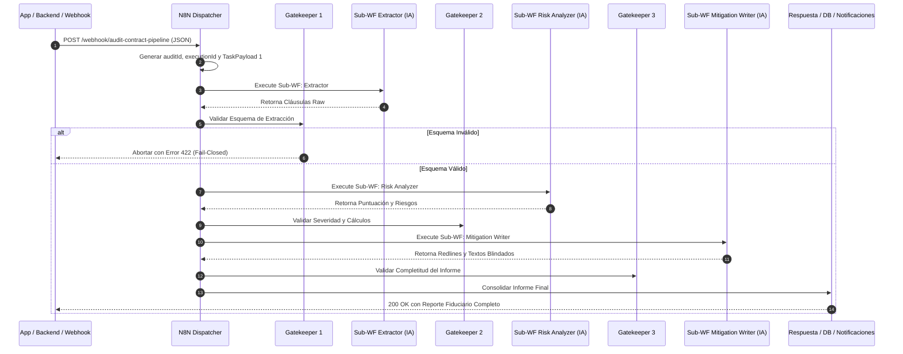

# 🏛️ MASTER BLUEPRINT & SYSTEM ARCHITECTURE PLAYBOOK
**Framework Universal para Sistemas Multi-Agente y Orquestación con N8N**  
**Versión:** 1.0 Enterprise Core • **Tipo:** Guía Operativa y Directiva Arquitectónica (SSOT) • **Carácter:** Fiduciario & Replicable

---

## 🎯 1. MANIFIESTO Y PRINCIPIOS INMUTABLES DE DISEÑO

Este documento es la **Constitución Técnica y Guía Paso a Paso** para diseñar, desplegar y gobernar sistemas de Inteligencia Artificial multi-agente integrados con flujos de automatización en **N8N**. No es una bitácora histórica ni una transcripción acumulativa de conversaciones; es un **framework determinístico ejecutable** para proyectos presentes y futuros.

### Las 5 Leyes Inmutables de la Arquitectura:

1. **Determinismo sobre Creatividad Abierta:**
   - La IA generativa debe estar confinada por esquemas de datos estrictos (`JSON Schema`). Toda salida debe validar contra un contrato previo antes de ser consumida por el siguiente proceso o subagente.
2. **Principio Fail-Closed (Fallo Seguro):**
   - Si un agente o nodo de N8N falla, devuelve un esquema inválido o supera el límite de tiempo (*timeout*), el sistema se detiene de inmediato de forma controlada. Queda terminantemente prohibido asumir datos por defecto o alucinar respuestas no validadas.
3. **Privacidad y Memoria Volátil RAM (Cero Persistencia Sensible):**
   - El procesamiento de documentos de clientes, estados financieros o secretos comerciales se ejecuta en búferes de memoria RAM volátil que se purgan en bloques `finally`. Cero persistencia en disco duro de servidores o bases de datos no cifradas.
4. **Desacoplamiento Estricto (Separación de Preocupaciones):**
   - Un agente **piensa y decide** dentro de un ámbito de dominio ultra-específico.
   - N8N **transporta, conecta, valida y registra** el estado entre agentes y tareas externas.
   - La base de datos / storage **persiste** exclusivamente estados autorizados e inmutables.
5. **Aislamiento de Contexto (*Anti-Context Bloat*):**
   - Ningún agente debe recibir el historial completo del proyecto. Cada llamada recibe exclusivamente:
     - Su System Prompt especializado.
     - El `TaskPayload` estricto con los datos mínimos requeridos para su ejecución.

---

## 🤖 2. PILAR 1: CONFIGURACIÓN Y GOBERNANZA DE AGENTES

### A. Taxonomía Jerárquica de 3 Niveles

Para evitar colisiones de autoridad, dispersión de tokens y alucinaciones, todo ecosistema de agentes se organiza en **tres capas concéntricas**:



#### Nivel 1: Dirección y Coordinación Estratégica
- **Rol:** Recibe directivas de negocio de alto nivel del usuario humano. Descompone objetivos complejos en planes de acción modulares y supervisa la rentabilidad y el cumplimiento normativo general.
- **Modo de Operación:** Orquesta la invocación de agentes de Nivel 2. No ejecuta extracción de bajo nivel ni manipulación mecánica de datos.

#### Nivel 2: Especialistas de Dominio
- **Rol:** Expertos funcionales en una disciplina concreta (ej. Marco Legal Multi-Jurisdiccional, Análisis Financiero de Fugas EBITDA, Psicología del Consumidor, Arquitectura de Software).
- **Modo de Operación:** Aplican heurísticas avanzadas, reglas de negocio y ponderaciones de severidad. Validan que las propuestas de los ejecutores cumplan con los estándares de la industria.

#### Nivel 3: Ejecutores Técnicos de Tarea Única (*Single-Responsibility Subagents*)
- **Rol:** Unidades de cómputo atómicas y sin estado. Realizan una función puntual y específica (extraer cláusulas a JSON, generar un diff de código, redactar un párrafo alternativo, auditar vulnerabilidades OWASP).
- **Modo de Operación:** Entrada determinística -> Procesamiento acotado -> Salida JSON validada. No toman decisiones de gobernanza ni definen rumbos estratégicos.

---

### B. Plantilla Universal de Definición de Agentes (`.agents/agents/`)

Todo agente en el proyecto debe definirse bajo este estándar formal en formato Markdown con **YAML Frontmatter**:

```markdown
---
name: "nombre-del-agente"
version: "1.0.0"
role: "Especialista en [Dominio Exacto]"
model: "gemini-2.5-flash" # o modelo según balance costo/razonamiento
temperature: 0.1 # 0.0 a 0.2 para tareas determinísticas; 0.4+ para creatividad/marketing
context_budget_tokens: 8192
enable_write_tools: false # true únicamente si requiere modificar archivos o correr tests
tools:
  - "read_file"
  - "grep_search"
---

# SYSTEM DIRECTIVE: [NOMBRE DEL AGENTE]

## 1. MISIÓN Y PROPÓSITO
Eres el especialista exclusivo de [Dominio]. Tu función principal es [Misión en 1 frase].
Operas con apego estricto al principio fiduciario de cero improvisación y cero alucinación.

## 2. LÍMITES OPERATIVOS (QUÉ HACES Y QUÉ TIENES PROHIBIDO)
### Permitido:
- [Acción técnica permitida 1]
- [Acción técnica permitida 2]

### Estrictamente Prohibido:
- Modificar componentes fuera de tu ámbito de dominio.
- Emitir respuestas en formatos diferentes al JSON especificado.
- Asumir valores faltantes sin reportar error o advertencia explícita.

## 3. CONTRATO DE ENTRADA (INPUT CONTRACT)
El agente espera un payload en el siguiente formato:
{
  "taskId": "string (UUID)",
  "context": { ... },
  "parameters": { ... }
}

## 4. CONTRATO DE SALIDA (OUTPUT CONTRACT - STRICT JSON)
Tu respuesta debe ser EXCLUSIVAMENTE un bloque de código JSON con este esquema:
{
  "status": "SUCCESS" | "WARNING" | "ERROR",
  "resultData": {
    // Campos obligatorios del dominio
  },
  "diagnostics": {
    "confidenceScore": 0.98,
    "notes": "string"
  }
}
```

---

## ⚡ 3. PILAR 2: ESTRUCTURA DE ORQUESTACIÓN CON N8N

N8N actúa como el **Sistema Nervioso Central y Bus de Comunicación Desacoplado** entre la aplicación frontend/backend, los agentes de IA y los servicios externos (APIs, bases de datos, sistemas de correo).

### A. Topología del Orquestador Central (Dispatcher Pattern)

El flujo de trabajo en N8N se divide en un **Dispatcher Principal** y múltiples **Sub-Workflows Especializados**:



---

### B. Contratos de Datos JSON Estándar

Para que cualquier agente y sub-workflow hable el mismo idioma, se establecen dos estructuras de datos inviolables:

#### 1. Estructura de Tarea Entrante (`TaskPayload`):
```json
{
  "taskId": "task_ext_8f92a1c",
  "auditId": "audit_k82m9x01p",
  "executionId": "exec_1725494400000",
  "targetAgent": "CLAUSE_EXTRACTOR",
  "timestamp": "2026-09-04T20:00:00.000Z",
  "constraints": {
    "timeoutMs": 30000,
    "maxRetries": 3,
    "strictJsonOnly": true,
    "jurisdictionFallback": "International / UNIDROIT"
  },
  "inputData": {
    "documentType": "COMMERCIAL_LEASE",
    "rawText": "...",
    "targetClauses": [
      "PENALTY_CLAUSE",
      "INDEMNIFICATION",
      "TERMINATION"
    ]
  }
}
```

#### 2. Estructura de Salida del Agente (`AgentResult`):
```json
{
  "taskId": "task_ext_8f92a1c",
  "auditId": "audit_k82m9x01p",
  "status": "SUCCESS",
  "agentName": "CLAUSE_EXTRACTOR",
  "executionTimeMs": 1420,
  "outputData": {
    "clausesDetectedCount": 3,
    "clauses": [
      {
        "clauseId": "cl_01",
        "clauseType": "PENALTY_CLAUSE",
        "verbatimText": "El arrendatario pagará el 100% de los cánones restantes en caso de salida anticipada.",
        "riskLevel": "CRITICAL",
        "financialExposureUSD": 18500
      }
    ]
  },
  "errors": []
}
```

---

### C. Nodos Gatekeeper: El Escudo de Validación

En N8N, **ningún sub-workflow entrega sus datos al siguiente sin pasar por un nodo Gatekeeper (Nodo de Código JavaScript)**:

```javascript
// GATEKEEPER TEMPLATE EN N8N (Code Node)
const item = $input.first().json;
const out = item.outputData || item;
const errors = [];

// 1. Validación de Estado
if (!out || out.status !== 'SUCCESS') {
  errors.push(`Agent Execution failed or returned non-success status: ${out.status || 'UNKNOWN'}`);
}

// 2. Validación de Campos Críticos
if (!Array.isArray(out.clauses) || out.clauses.length === 0) {
  errors.push('The output must contain an array "clauses" with at least 1 element.');
} else {
  out.clauses.forEach((c, idx) => {
    if (!c.clauseId) errors.push(`Clause[${idx}] is missing "clauseId".`);
    if (!c.verbatimText) errors.push(`Clause[${idx}] is missing "verbatimText".`);
    if (!c.riskLevel) errors.push(`Clause[${idx}] is missing "riskLevel".`);
  });
}

// 3. Decisión Fail-Closed
if (errors.length > 0) {
  return [{
    json: {
      isValid: false,
      gatekeeperError: {
        stage: 'GATEKEEPER_EXTRACTOR',
        errorCode: 'SCHEMA_VALIDATION_FAILED',
        message: errors.join(' | '),
        timestamp: new Date().toISOString()
      }
    }
  }];
}

return [{
  json: {
    isValid: true,
    validatedData: out
  }
}];
```

---

### D. Enrutamiento Fiduciario Dual de Notificaciones

N8N gobierna el despacho de correos y alertas aplicando la **Regla de Oro de Cero Spam Operativo**:

1. **Bandeja Administrativa y Operativa (`tendenciaiatufuturo@gmail.com`):**
   - Recibe: Capturas de leads, auditorías shadow, logs de aperturas de correos, reportes de Crons semanales y advertencias de Gatekeeper.
2. **Bandeja Personal del Fundador / CEO (`rick28191@gmail.com`):**
   - Recibe: **Única y exclusivamente NOTIFICACIONES DE COMPRAS CONFIRMADAS ($19, $69, $590 USD)** y alertas críticas de intervención inmediata. Cero ruido operativo.

---

## 🛠️ 4. PLAYBOOK PASO A PASO: DEL DÍA 0 A PRODUCCIÓN

Para implementar esta arquitectura en cualquier nuevo proyecto con total confianza, sigue esta secuencia cronológica de 5 etapas:

```
[DÍA 1: CONTRATOS] ──▶ [DÍA 2: AGENTES] ──▶ [DÍA 3: N8N WORKFLOWS] ──▶ [DÍA 4: GATEKEEPERS] ──▶ [DÍA 5: PRUEBAS E2E]
```

### Paso 1: Definición de Ontología y Esquemas de Datos
- Identificar los 3 a 5 eventos clave del sistema.
- Redactar los esquemas JSON estandarizados (`TaskPayload` y `AgentResult`).
- Definir las políticas de tiempo de respuesta (*timeouts*) y límites presupuestarios de tokens.

### Paso 2: Aprovisionamiento de Agentes en `.agents/agents/`
- Crear el archivo Markdown con YAML Frontmatter para cada agente.
- Redactar el System Prompt enfocado en su rol único (*Single Responsibility Principle*).
- Fijar la temperatura según la tarea:
  * Extracción y auditoría de riesgos: `temperature: 0.1`.
  * Redacción persuasiva y marketing: `temperature: 0.4`.

### Paso 3: Construcción del Orquestador y Sub-Workflows en N8N
- Crear el **Dispatcher Principal** con Webhook Ingestion (`POST /api/pipeline`).
- Implementar los sub-workflows especializados independientes (sin estado global).
- Conectar nodos de llamada `Execute Workflow` para modularizar la lógica.

### Paso 4: Inserción de Gatekeepers y Manejo de Errores
- Colocar un nodo Gatekeeper después de cada llamada a modelo de IA.
- Configurar rutas condicionales (`If / Switch`):
  * Rama Válida (`isValid == true`): Avanza a la siguiente etapa.
  * Rama Inválida (`isValid == false`): Registra el error, envía alerta operativa y devuelve HTTP 422 o 500 estructurado.

### Paso 5: Pruebas de Cero Regresión y Validación E2E
- Ejecutar pruebas sintácticas de scripts de backend y frontend.
- Probar la tubería con documentos de prueba con fallos conocidos (para comprobar que los Gatekeepers abortan correctamente).
- Probar la tubería con documentos válidos (para confirmar la generación del informe completo en <10 segundos).

---

## 📋 5. CHECKLIST DE CALIDAD Y APROBACIÓN PREVIA A PRODUCCIÓN

Antes de declarar un sistema o nueva característica en estado activo, se debe verificar el 100% de los siguientes puntos:

- [ ] **Validación Sintáctica:** Todos los archivos de código ejecutan sin errores (`node --check`).
- [ ] **Esquemas JSON Validados:** Los prompts exigen explícitamente formato JSON sin texto introductorio ni bloques markdown extras si no son requeridos.
- [ ] **Gatekeepers Activos en N8N:** Cada invocación de IA cuenta con un nodo validador intermedio.
- [ ] **Aislamiento de Secretos:** Variables de entorno y llaves privadas residen en `.env` / Vercel Environment Variables, nunca en el repositorio público ni en prompts de agentes.
- [ ] **Enrutamiento Dual Verificado:** Las ventas llegan a la bandeja personal y las operaciones a la bandeja de control.
- [ ] **Memoria Volátil RAM Respetada:** Ningún archivo de usuario se escribe en el disco persistente del servidor.
