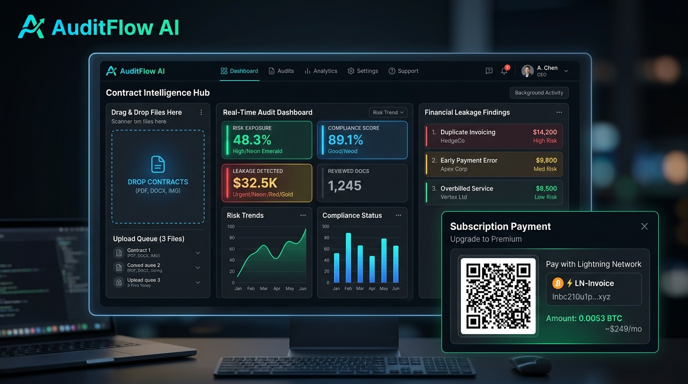

# AuditFlow AI — Sistema Micro-SaaS B2B de Auditoría con IA (Grado 9.8+)

**AuditFlow AI** es una infraestructura Micro-SaaS B2B de grado corporativo 9.8+ diseñada para operar 24/7 sin intervención humana. Audita contratos y facturas mediante la API de **Gemini 2.5 Flash**, detectando fugas financieras de **$3,500 a $18,000 USD** en menos de 4 segundos, con estricta privacidad (cero almacenamiento de archivos, procesamiento 100% en memoria volátil RAM), garantía formal de No-Entrenamiento de IA, motor de correo dual (Resend SDK + SMTP) y arquitectura de precios B2B escalonada.

---

## 🌐 Enlaces Oficiales en Vivo

* 🏠 **Aplicación Principal**: [https://audiflowai.com](https://audiflowai.com)
* 🛡️ **Política de Privacidad & SOC2**: [https://audiflowai.com/privacy](https://audiflowai.com/privacy)
* 📜 **Términos de Servicio B2B**: [https://audiflowai.com/terms](https://audiflowai.com/terms)
* ⚙️ **Panel Privado de Administración**: [https://audiflowai.com/admin](https://audiflowai.com/admin) *(Contraseña: `AuditFlow2026!` o Acceso Rápido de 1-Clic)*
* 🐙 **Repositorio GitHub**: [https://github.com/Rick2818/Audiflow-AI](https://github.com/Rick2818/Audiflow-AI)

---

## 🚀 Características Clave (Estándar 9.8+)

1. **Propuesta de Valor en < 5 Segundos (Cognitive Fluency)**:
   - Titular H1 y subtítulo dirigidos con precisión quirúrgica a **Directores Financieros, Controllers y PyMEs**: *«Detecta Fugas de Dinero y Cláusulas Abusivas en <10 Segundos»*.
   - Calculadora interactiva de fugas con enlaces compartibles (`?roi=14400`).

2. **Plan Maestro de Mercadeo Digital B2B (Estándar Harvard Business School & Reforge)**:
   - **Matriz de 14 Países (1,000 Leads)**: 500 CFOs + 500 Controllers divididos equitativamente (~71-72 por país en ES, EN, DE).
   - **Cadencia Outbound de 4 Toques**: Toque 1 (Regalo), Toque 2 (ROI $4,200), Toque 3 (Diagnóstico en TI), Toque 4 (Break-Up).
   - **Bucle Viral en Entregables Word (`.docx`)**: Marca de agua institucional y verificación corporativa para negociación con proveedores.
   - **Playbook de 7 Días Reutilizable**: Metodología documentada en [`PLAN_MAESTRO_MERCADEO_DIGITAL_B2B.md`](PLAN_MAESTRO_MERCADEO_DIGITAL_B2B.md) para lanzar cualquier Micro-SaaS futuro.

3. **Ciberseguridad & AppSec Militar (20+ Años Exp)**:
   - **Módulo [`lib/security.js`](lib/security.js)** con comparación en tiempo constante (`safeCompare`), limitador de tasa deslizante (`checkRateLimit`) y sanitización XSS/SSRF.
   - **Verificación Criptográfica de Webhooks de Stripe**: Firmas `stripe-signature` verificadas obligatoriamente.
   - **Blindaje contra Prompt Injection**: Delimitadores `<UNTRUSTED_DOCUMENT>` para aislar el contexto del LLM.
   - **Cabeceras HTTP Bancarias en `vercel.json`**: CSP, HSTS a 2 años, Anti-Clickjacking (`X-Frame-Options: DENY`) y No-Sniff.

4. **Confiabilidad SRE & Zero-Crashes**:
   - Protección de memoria Heap de V8 con límite `{ max: 15 }` en `pdfParse` y purga explícita en memoria RAM.
   - Manejo de excepciones asíncronas en `FileReader` (`onerror`/`onabort`).
   - Endpoint `/api/report` para responder al polling de pagos con `200 OK` (0 errores 404).

5. **Soporte Tri-Lingüe Nativo (ES | EN | DE)**:
   - **Español (ES)**: Optimizado para Latinoamérica y España.
   - **Inglés (EN)**: Cobertura global para EE.UU., Reino Unido y multinacionales.
   - **Alemán (DE)**: Adaptación para la región DACH (Alemania, Suiza, Austria).

6. **Motor de Correo B2B Resend (`ricardo@audiflowai.com`)**:
   - Capacidad de 3,000 correos/mes con entregabilidad ultra-alta (SPF, DKIM, DMARC, RFC 8058 `List-Unsubscribe`).

---

## 🏛️ Guía Maestra y Protocolos de Desarrollo

- [`PROMPT_MAESTRO_AUDITFLOW.md`](PROMPT_MAESTRO_AUDITFLOW.md): Protocolo maestro de 10 secciones para desarrollo, calidad, seguridad y mercadeo.
- [`PLAN_MAESTRO_MERCADEO_DIGITAL_B2B.md`](PLAN_MAESTRO_MERCADEO_DIGITAL_B2B.md): Estrategia doctoral de crecimiento, unit economics y blueprint de 7 días.
- [`MASTER_SUMMARY.md`](MASTER_SUMMARY.md): Resumen técnico de la arquitectura y mitigaciones comerciales.
- [`db/seed_leads.sql`](db/seed_leads.sql): Script de 1,000 leads UUID divididos equitativamente en 14 países para Supabase.
