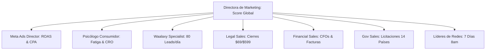

# 📊 BALANCED SCORECARD (BSC) — EVALUACIÓN DEL RENDIMIENTO DE MARKETING Y EQUIPO MULTI-AGENTE
**AuditFlow AI** • **Comité de Dirección Ejecutiva**  
**Diseñado por:** Gerente General y Director de Operaciones (GM / COO)  
**Para:** Ricardo (Director General / CEO) & Directora de Marketing y Ventas (CMVO)  
**Periodicidad de Evaluación:** Diaria (Pacing), Semanal (Comité Lunes 8:00 AM) y Mensual  
**Moneda de Control:** Dólares Americanos (USD: $)

---

## 🏛️ 1. MARCO METODOLÓGICO Y MATRIZ DE PONDERACIÓN (KAPLAN & NORTON B2B)

El rendimiento de la **Directora de Marketing y Ventas (CMVO)** y su escuadrón de agentes se evalúa a través de las 4 perspectivas estratégicas integradas, con un puntaje global sobre **100 Puntos**:

```
┌─────────────────────────────────────────────────────────────┬───────────┐
│ PERSPECTIVA ESTRATÉGICA                                     │ PONDERACIÓN│
├─────────────────────────────────────────────────────────────┼───────────┤
│ 1. Perspectiva Financiera & Flujo de Caja USD               │    35%    │
│ 2. Perspectiva del Cliente, Conversión & Anti-Fatiga        │    25%    │
│ 3. Perspectiva de Procesos Internos & Prospección 7 Días    │    25%    │
│ 4. Perspectiva de Tecnología, Innovación & n8n              │    15%    │
├─────────────────────────────────────────────────────────────┼───────────┤
│ TOTAL SCORECARD                                             │   100%    │
└─────────────────────────────────────────────────────────────┴───────────┘
```

---

## 📈 2. TABLERO MAESTRO DE CONTROL POR PERSPECTIVAS

### 💰 I. PERSPECTIVA FINANCIERA & GENERACIÓN DE INGRESOS (Ponderación: 35%)
*Custodia del retorno del capital, cumplimiento de cuota diaria y maximización de márgenes operativos.*

| KPI / Métrica Clave | Meta Diaria / Semanal | Umbral Mínimo Aceptable | Puntos (35) | Método de Medición |
| :--- | :--- | :--- | :---: | :--- |
| **Cuota Diaria de Clientes** | $\ge$ 1 Cliente nuevo / día | 5 Clientes / semana | 15 pts | Stripe / Strike Webhooks |
| **ROAS Consolidado (Meta Ads)** | $\ge$ 4.5x en USD | 3.5x en USD | 8 pts | Meta Ads Manager / n8n |
| **Costo Adquisición (CAC Blended)**| $\le$ $18.00 USD | $\le$ $24.00 USD | 6 pts | Gasto Total / Clientes Nuevos |
| **Nuevos Ingresos Recurrentes (MRR)**| +$2,070 USD / mes | +$1,500 USD / mes | 6 pts | Suscripciones Pro ($69/m) activas |

---

### 🧠 II. PERSPECTIVA DEL CLIENTE, CONVERSIÓN & ANTI-FATIGA (Ponderación: 25%)
*Atracción sin saturación, experiencia de usuario sin fricción y retención de decisores fiduciarios.*

| KPI / Métrica Clave | Meta Estratégica | Umbral Mínimo | Puntos (25) | Responsable / Fuente |
| :--- | :--- | :--- | :---: | :--- |
| **Tasa de Activación Demo 1-Clic** | $\ge$ 45% de visitantes únicos | 30% de visitantes | 8 pts | Google Analytics / Clarity |
| **Conversión Paywall ($19 / $69)** | $\ge$ 4.8% de quienes prueban demo | 2.5% | 7 pts | Embudo de Stripe |
| **Ad Fatigue Index (Frecuencia)** | Frecuencia $\le$ 2.4 / semana | Frecuencia $\le$ 2.8 | 5 pts | `consumer-behavior-diagnostician` |
| **Tasa de Respuesta Multilingüe** | $< 3$ segundos (24/7) | $< 10$ segundos | 5 pts | Webhook Bridge / n8n |

---

### ⚙️ III. PERSPECTIVA DE PROCESOS INTERNOS & PROSPECCIÓN (Ponderación: 25%)
*Disciplina de ejecución 7 días a la semana, outbound fiduciario y cobertura en 14 países.*

| KPI / Métrica Clave | Meta Estratégica | Umbral Mínimo | Puntos (25) | Responsable / Fuente |
| :--- | :--- | :--- | :---: | :--- |
| **Publicación Diaria (7 Días)** | 7 días / semana a las 8:00 AM | 7 días (0 ausencias) | 7 pts | `social_published_feed.json` |
| **Prospección Waalaxy LinkedIn** | 80 contactos B2B / día (CFO/CLO) | 50 contactos / día | 6 pts | `waalaxy-specialist` |
| **Pipeline Sector Público / B2B** | 3 demos institucionales / sem | 1 demo / semana | 6 pts | `gov-sales` / `legal-sales` |
| **Entrega de Redlines (.docx)** | 100% con Control de Cambios | 100% sin fallas | 6 pts | `api/export-docx` |

---

### 🚀 IV. PERSPECTIVA DE TECNOLOGÍA & AUTOMATIZACIÓN (Ponderación: 15%)
*Cero intervención humana, integridad de datos y gobernanza desatendida.*

| KPI / Métrica Clave | Meta Estratégica | Umbral Mínimo | Puntos (15) | Responsable / Fuente |
| :--- | :--- | :--- | :---: | :--- |
| **Conectividad n8n & Webhooks** | 99.9% Uptime de Webhooks | 98.0% | 5 pts | Logs de n8n / Bridge |
| **Reportes Automáticos al CEO** | 8:00 AM (Daily) + 5:00 PM (Vie) | 100% puntualidad | 5 pts | Gmail SMTP / Resend |
| **Calidad de Píxel & CAPI Meta** | Match Quality Score $\ge$ 8.5/10 | Match Score $\ge$ 7.5 | 5 pts | Meta Event Manager |

---

## 🎯 3. SCORECARD INDIVIDUAL POR ROL Y AGENTE



### 1. Directora de Marketing y Ventas (`marketing-director`)
* **Misión Principal:** Cumplimiento estricto de **$\ge 1$ cliente nuevo al día** y coordinación sinérgica de los 8 subagentes.
* **Escala de Calificación:**
  * **90 - 100 pts:** Sobresaliente (Bono de escalado presupuestario +25%).
  * **75 - 89 pts:** Satisfactorio (Mantenimiento de estrategia).
  * **< 75 pts:** En Observación (Activación de protocolo de contingencia a las 3:00 PM por el Gerente General).

### 2. Director Senior de Meta Ads (`meta-ads-specialist`)
* **Métrica Central:** ROAS $\ge$ 4.5x, CPA $\le$ $15 USD, Cero desperdicio presupuestario.
* **Penalización Automática:** Apagado inmediato de cualquier conjunto de anuncios que gaste $30 USD sin generar al menos 1 cliente de $19 o $69.

### 3. Psicólogo del Consumidor & Anti-Fatiga (`consumer-behavior-diagnostician`)
* **Métrica Central:** Tasa de conversión del Demo 1-Clic ($\ge 45\%$), Frecuencia de anuncios $< 2.8$, Cero saturación de audiencia.
* **Poder de Veto:** Capacidad de pausar cualquier campaña publicitaria o secuencia de emails que degrade la percepción de marca fiduciaria.

### 4. Especialistas Senior de Ventas (`legal-sales`, `financial-sales`, `gov-sales`)
* **Métrica Central:** Tasa de cierre sobre leads calificados $\ge 22\%$.
* **Entregable Obligatorio:** Minuta de cotización y despacho de informe de prueba en Word (.docx) en menos de 15 minutos tras el contacto.

### 5. Especialista en Automatización Waalaxy (`waalaxy-specialist`)
* **Métrica Central:** 500 invitaciones aceptadas por mes, tasa de respuesta a mensajes con disparadores de *trending topics* $\ge 18\%$.

---

## 📋 4. PROTOCOLO DE EVALUACIÓN EN LAS REUNIONES DE DIRECCIÓN

1. **Daily Standup Automático (Lunes a Viernes 8:00 AM):**
   - El sistema n8n calcula el puntaje preliminar de las últimas 24 horas y lo adjunta al *Daily Executive Briefing* recibido por Ricardo y el COO.
2. **Revisión Semanal del Comité (Lunes 8:00 AM):**
   - El **Gerente General (COO)** abre la sesión proyectando el Balance Scorecard consolidado de la semana previa.
   - Si la puntuación de Marketing es inferior a 80 puntos, la CMVO debe presentar el **Plan de Acción Correctivo Inmediato** para ser aprobado o modificado por Ricardo y el COO.
3. **Regla de Contingencia Fiduciaria (3:00 PM):**
   - Si a las 3:00 PM del día en curso el contador de clientes está en 0, el sistema dispara automáticamente una alerta y reasigna el 50% de los esfuerzos a outbound de alta urgencia sobre la base de carritos abandonados e interactuadores calificados.
